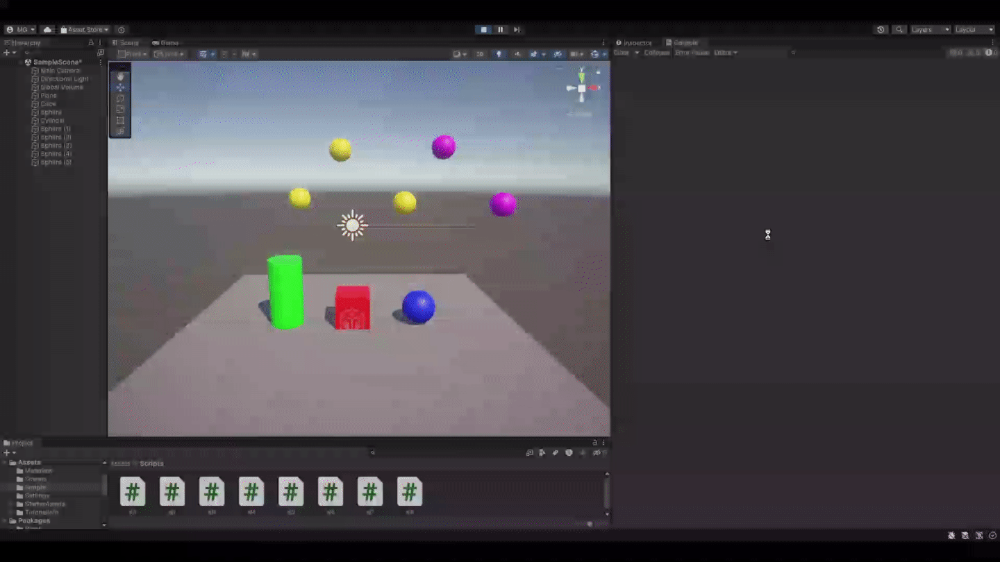
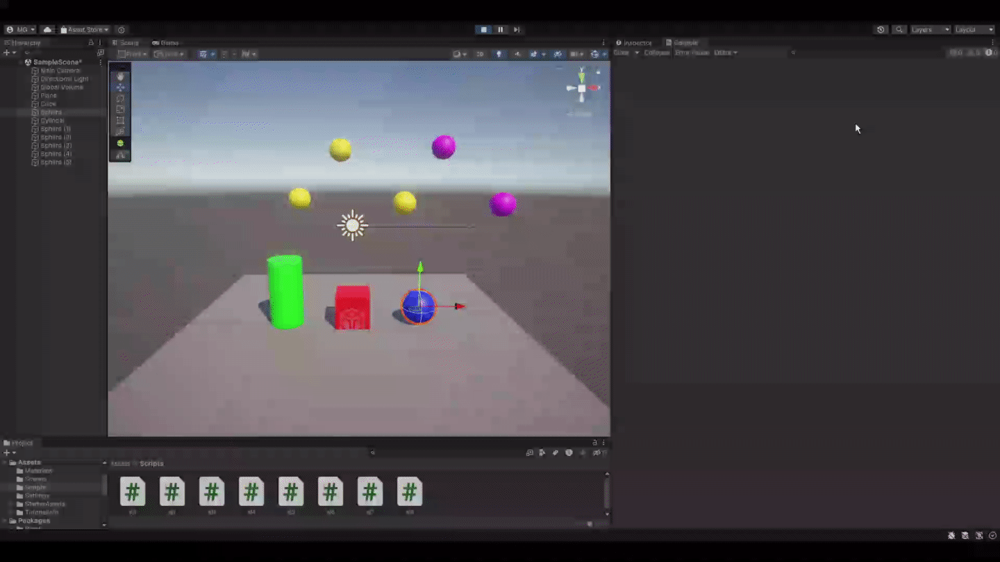
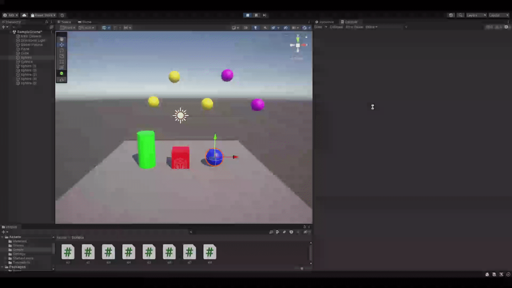

# Interfaces Inteligentes
## Práctica 2 - Introducción a C# - Scripts

- Ejercicio 1:  
Se crea un array que va tomando valores aleatorios cada frame dentro de un rango dado. Se muestran por consola los valores superiores a 15. Se puede modificar el rango en el inspector.  
  

- Ejercicio 2:  
Se muestran por consola los nombres de los objetos.  
  

- Ejercicio 3:  
Se crean dos vectores que pueden ser modificados desde el inspector. 
Se muestran tanto por pantalla como en el inspector:
    - La magitud de los vectores
    - El ángulo que forman
    - La distancia entre ambos
    - Por consola se indica cuál de los dos posee mayor altura
  

- Ejercicio 4:  
Se muestra por consola el vector de posición de la esfera.  
  

- Ejercicio 5:  
Se muestra por consola la distancia entre los objetos.  
  

- Ejercicio 6:  
Se alinean el cilindro y el cubo con la esfera.
  

- Ejercicio 7:  
El cilindro cambia de color al pulsar la tecla 'A', y el cubo al pulsar la flecha hacia arriba.
  

- Ejercicio 8:  
La esfera más cercana al cubo aumenta su altura en 0.01 por cada frame. La esfera más alejada del cubo cambia de color al pulsar espacio.
  
